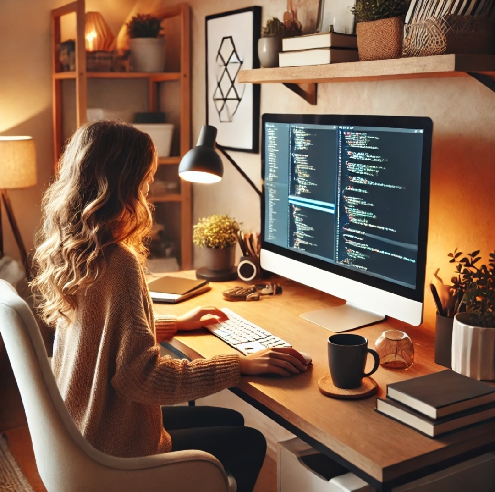

  
  <h1>👋 Hi, I'm Ladan Hazrati</h1>
  <h4>Frontend Developer | Crafting modern, responsive web experiences</h4>
   

---

## 🪄 About Me  

I’m **Ladan Hazrati**, a dedicated **Frontend Developer** passionate about building elegant, responsive, and user-focused web applications.  
I love turning ideas into interactive digital experiences using modern technologies and creative design principles.  
Always learning and growing, I aim to craft clean, efficient, and enjoyable interfaces that make users feel at ease while using the web.

---

## 💡 My Expertise  

I specialize in developing modern, responsive, and performance-oriented web applications using **React** and **Next.js**.  
My main focus is creating clean, maintainable codebases and delivering smooth user experiences through thoughtful design and efficient front-end architecture.  
I’m comfortable working with tools like **Tailwind CSS**, **Styled Components**, and popular state management libraries such as **Zustand** and **Redux Toolkit**.  
Version control, teamwork, and continuous learning are core parts of how I approach development.

---

## 🔥 Work Philosophy  

I believe great front-end development is not just about code—it’s about empathy for users, clarity in design, and continuous improvement.  
My process combines creativity with precision, aiming to deliver products that feel effortless and visually balanced.

---

## 🌐 Connect with Me  

💼 [Website](https://www.ladanh.ir)  
🔗 [LinkedIn](https://www.linkedin.com/in/ladanhl)  
📧 [Email](mailto:ms_hazrati@yahoo.com)  
📂 [GitHub](https://github.com/ladan-hazrati-web)

---

